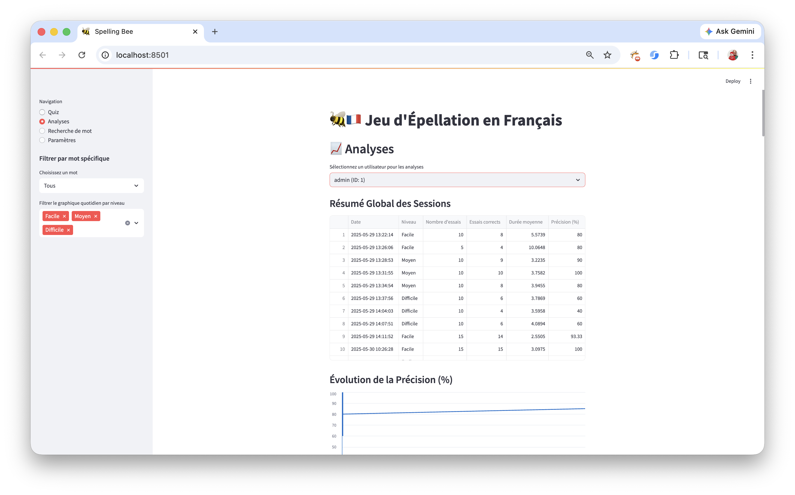
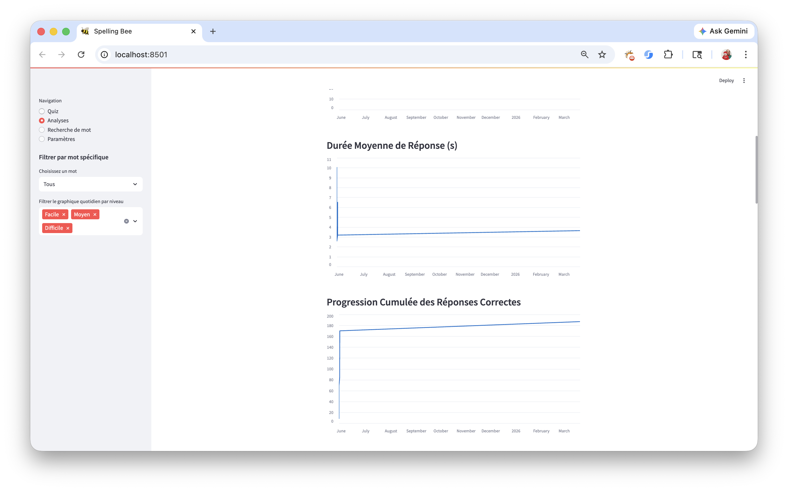
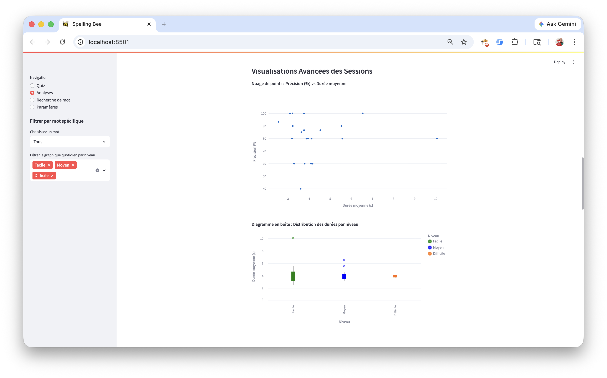
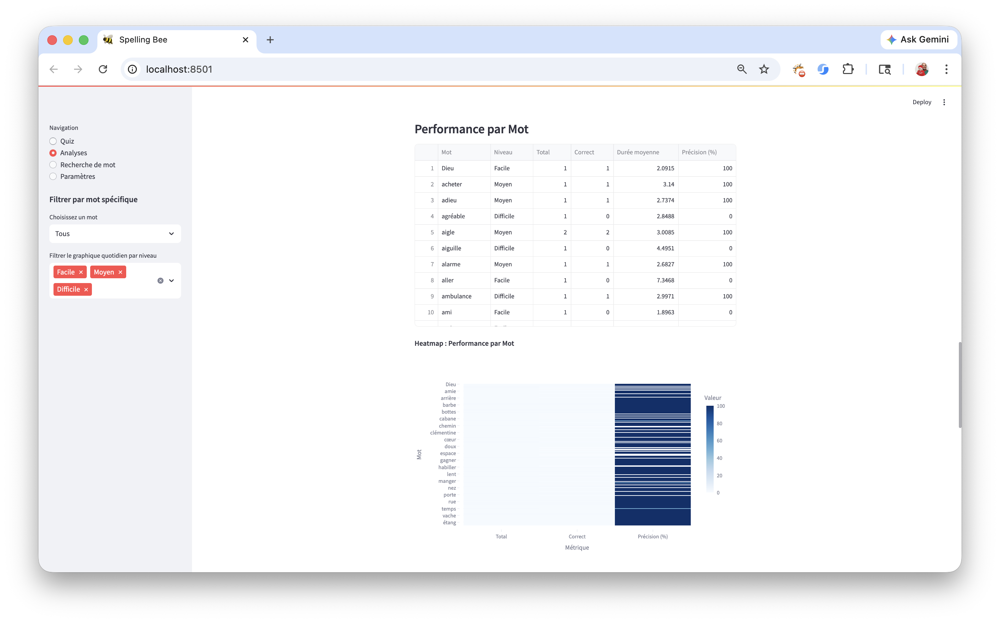
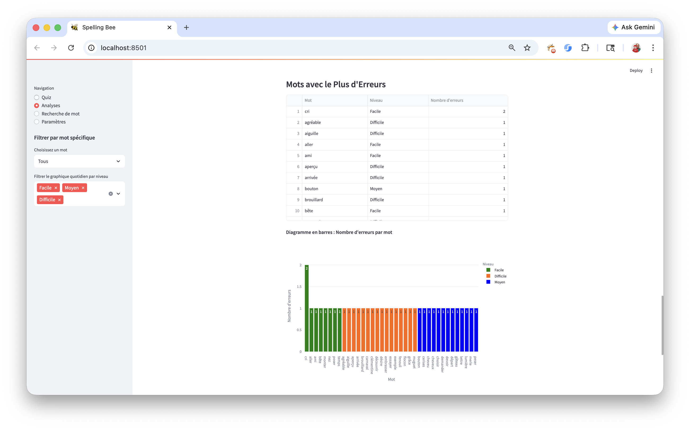
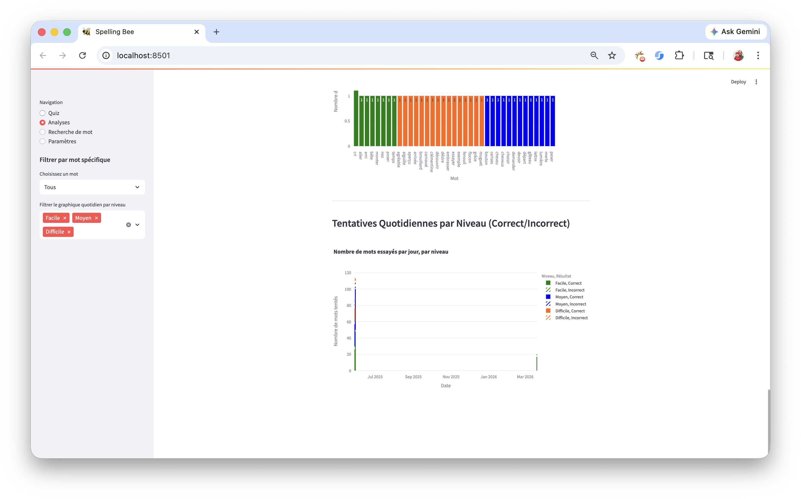

# 🐝🇫🇷 Jeu d'Épellation en Français

French Spelling Bee Practice Game

## 📖 Description

An interactive **French web-based Spelling Bee Practice Game** developed entirely independently using Python and the Streamlit framework. It was created as a personalized learning tool to help prepare for a real French spelling bee competition, through audio, repetition, and adaptative difficulty. The application played a key role in improving spelling performance and contributed to successful results in the competition.

The system uses a SQLite3 database to store words along with their corresponding context phrases and difficulty levels (**Easy, Medium, Hard**). It supports multiple users, including an admin account, allowing personalized tracking of progress and performance over time.

---

## 🧭 Features

The interface includes a sidebar navigation system with four main features:

### 1. Spelling Game

Users select a difficulty level and participate in a timed spelling session. Each word is pronounced aloud along with a context phrase, and the user has 30 seconds to input the correct spelling.

The evaluation requires full accuracy, including proper use of French accents (e.g., â, é, è, ê, î, ç), ensuring precise linguistic correctness. Unanswered words are marked as timeouts.

At the end of the session, results are displayed in a summary table showing correct and incorrect answers.

---

### 2. Performance Analysis

Provides detailed insights into user performance across sessions, including:

- Most frequently misspelled words  
- Average response time  
- Accuracy trends  
- Word-level performance  

Data is visualized through interactive graphs and tables.

---

### 3. Word Search

Allows users to search for specific words in the database and view their associated context phrases, reinforcing learning outside of gameplay.

---

### 4. Settings / Parameters

Enables customization of the number of words per session, allowing flexibility based on the user’s learning pace.

---

## 🧠 Project Highlights

- 🚀 Developed entirely independently from concept to deployment
- 🎓 Applies software development to solve a real-world educational problem
- 🌐 Combines backend data management with an interactive web-based GUI
- 📊 Uses SQLite3 for persistent data storage and performance tracking
- 🔊 Audio pronunciation powered by Google Text-to-Speech (gTTS)
- 🧩 Adaptive word selection
  - Prioritizes words the user struggles with
  - Balanced mix: 80% weak words / 20% random
- ⏱️ Timed responses (30 seconds per word)
- 👤 User-based sessions for personalized tracking
- 🎯 Level-based word selection for progressive learning
- 💬 Fully in French with real-time feedback (Correct / Incorrect)

---

## 🎯 Impact

This application was specifically created to support preparation for a French spelling bee competition in Ontario. It significantly improved spelling accuracy and confidence, contributing to strong performance in the contest.

---

## 🛠️ Technologies Used

- Python  
- Streamlit  
- SQLite3  
- gTTS (Google Text-to-Speech)
- Data Visualization (charts & tables)  

---

## ▶️ How to Run

```bash
pipenv shell             # Activates the Virtual Environment
pipenv sync              # Installs dependencies from Pipfile
streamlit run game.py    # Starts the application
⋮
deactivate               # When finished running the application, this command ends with the Virtual Environment
```

---

## 📸 Screenshots

### 🏠 Main Interface


*Main application interface displaying navigation sidebar and core features.*

---

### 👤 User Management


*User registration interface for creating a new player profile.*

---

### 🎮 Gameplay


*Screen where the user selects difficulty level and starts a new spelling session.*


*Active gameplay showing the user entering a spelling answer within the time limit.*


*Feedback displayed when the user provides a correct answer.*


*Feedback displayed when the user provides an incorrect answer.*

---

### 📊 Results


*Summary table displaying all correct and incorrect answers at the end of a session.*

---

### 📈 Performance Analysis


*Performance analysis dashboard showing user statistics and trends.*


*Detailed view of performance metrics including accuracy and response time.*


*Visualization of user progress across multiple sessions.*


*Analysis of most frequently misspelled words.*


*Graphical representation of performance trends over time.*


*Additional performance insights displayed through charts and tables.*

---

### 🔍 Word Search


*Word search feature allowing users to find words and view their context phrases.*

---

### ⚙️ Settings


*Settings page where users can configure session parameters such as number of words.*

---

## 🤝 Attribution

If you use or adapt this project, I would greatly appreciate a reference to the original repository or author:

**Fausto Gonzalez**  
Jeu d'Épellation en Français

GitHub: <https://github.com/ingfaustogonzalez/spelling-bee-practice-game>

This is not required by the license, but it helps support the project and its future development 🙏

---

## 📄 License

This project is licensed under the **MIT License**.

---

## 📬 Author

Fausto Gonzalez
