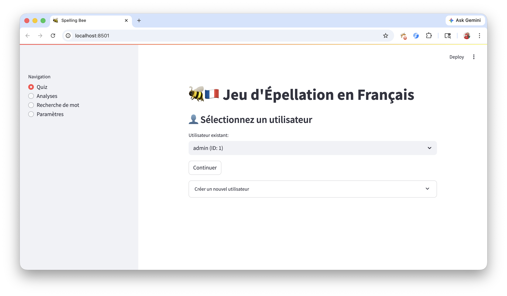
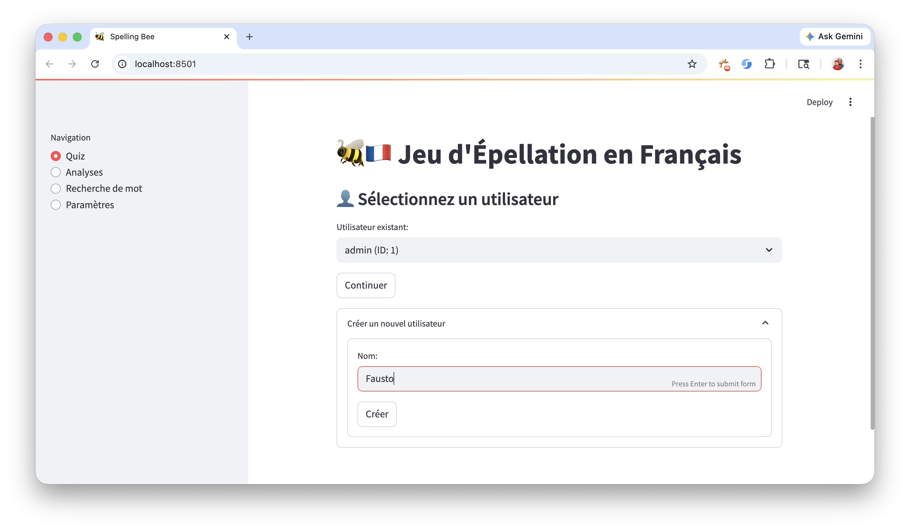
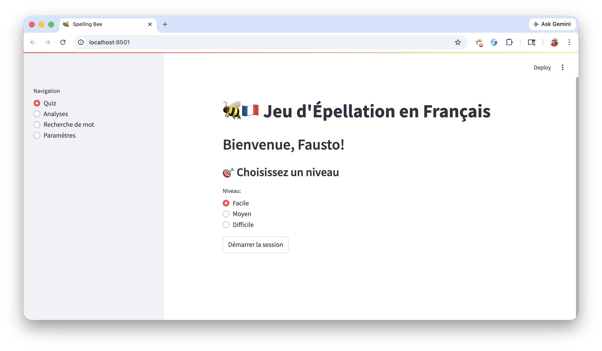
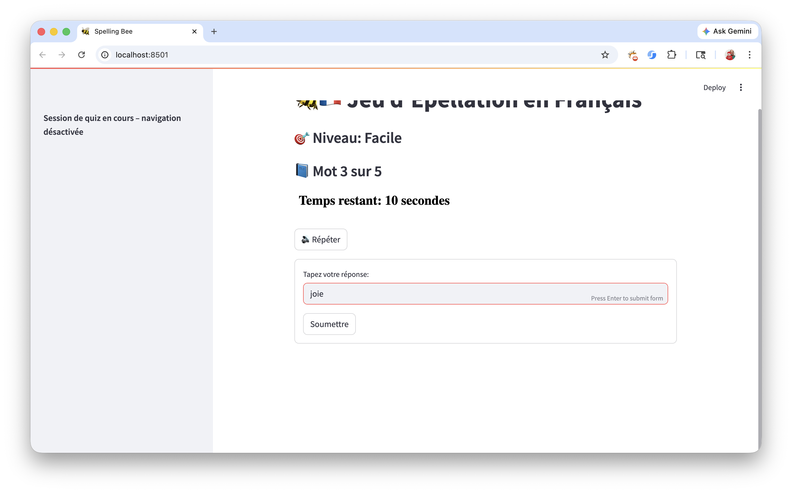
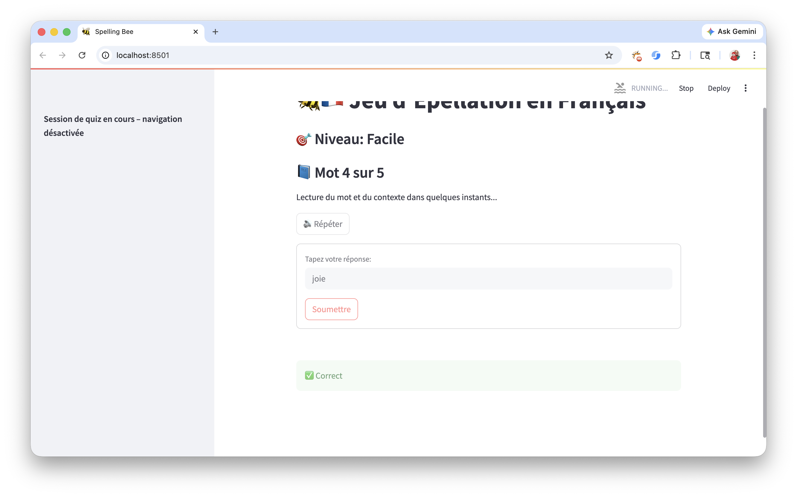
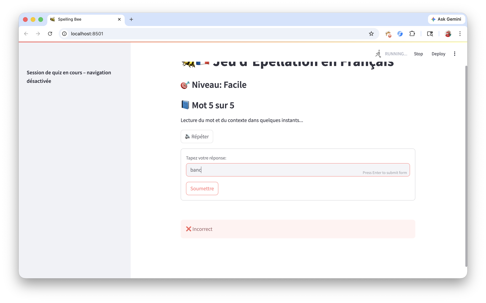
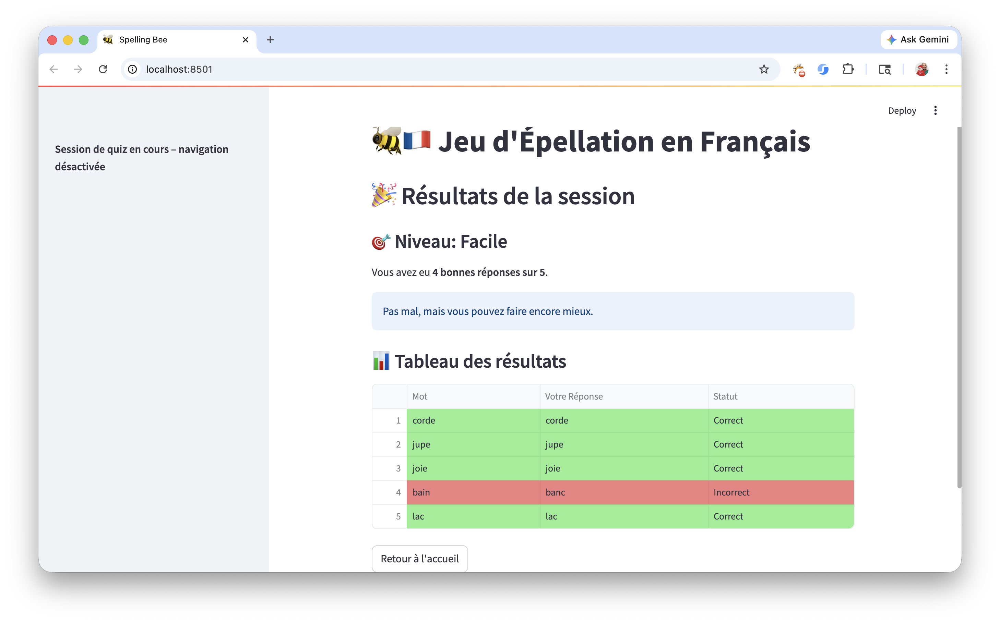
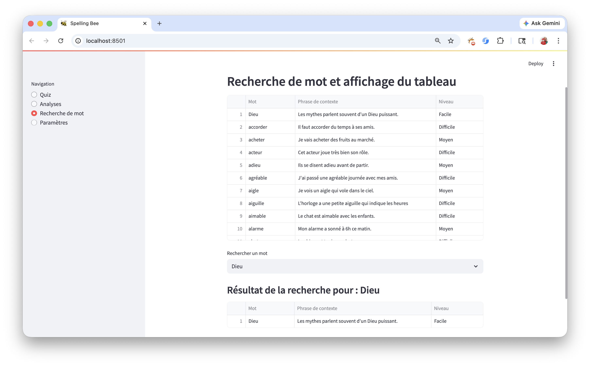
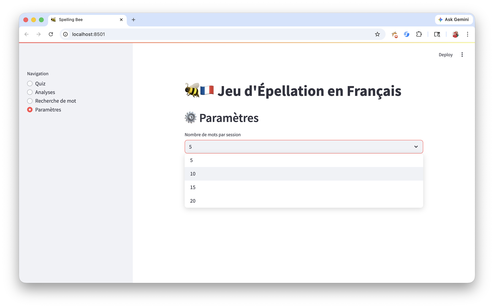

# 🐝🇫🇷 Jeu d'Épellation en Français
**Spelling Bee Practice Game in French**

## 📖 Description

This project is a French web-based Spelling Bee Practice Game developed entirely independently using Python and the Streamlit framework. It was created as a personalized educational tool to help prepare for a real French spelling bee competition. The application played a key role in improving spelling performance and contributed to successful results in the competition.

The system uses a SQLite3 database to store words along with their corresponding context phrases and difficulty levels (**Easy, Medium, Hard**). It supports multiple users, including an admin account, allowing personalized tracking of progress and performance over time.

---

## 🧭 Features

The interface includes a sidebar navigation system with four main features:

<p align="center">
  <br>
  <em>Main application interface displaying navigation sidebar and core features.</em>
</p>

### 1. Spelling Game
Users select a difficulty level and participate in a timed spelling session. Each word is pronounced aloud along with a context phrase, and the user has 30 seconds to input the correct spelling.

The evaluation requires full accuracy, including proper use of French accents (e.g., â, é, è, ê, î, ç), ensuring precise linguistic correctness. Unanswered words are marked as timeouts.

At the end of the session, results are displayed in a summary table showing correct and incorrect answers.

<p align="center">
  <br>
  <em>User registration interface for creating a new player profile.</em>
</p>

<p align="center">
  <br>
  <em>Screen where the user selects difficulty level and starts a new spelling session.</em>
</p>

<p align="center">
  <br>
  <em>Active gameplay showing the user entering a spelling answer within the time limit.</em>
</p>

<p align="center">
  <br>
  <em>Feedback displayed when the user provides a correct answer.</em>
</p>

<p align="center">
  <br>
  <em>Feedback displayed when the user provides an incorrect answer.</em>
</p>

<p align="center">
  <br>
  <em>Summary table displaying all correct and incorrect answers at the end of a session.</em>
</p>

---

### 2. Performance Analysis
Provides detailed insights into user performance across sessions, including:

- Most frequently misspelled words  
- Average response time  
- Accuracy trends  
- Word-level performance  

Data is visualized through interactive graphs and tables.

---

### 3. Word Search
Allows users to search for specific words in the database and view their associated context phrases, reinforcing learning outside of gameplay.

<p align="center">
  <br>
  <em>Word search feature allowing users to find words and view their context phrases.</em>
</p>

---

### 4. Settings / Parameters
Enables customization of the number of words per session, allowing flexibility based on the user’s learning pace.

<p align="center">
  <br>
  <em>Settings page where users can configure session parameters such as number of words.</em>
</p>

---

## 🧠 Project Highlights

- Developed entirely independently from concept to deployment  
- Combines backend data management with an interactive web-based GUI  
- Uses SQLite3 for persistent data storage  
- Implements real-time feedback and performance tracking  
- Applies software development to solve a real-world educational problem  

---

## 🎯 Impact

This application was specifically created to support preparation for a French spelling bee competition in Ontario. It significantly improved spelling accuracy and confidence, contributing to strong performance in the contest.

---

## 🛠️ Technologies Used

- Python  
- Streamlit  
- SQLite3  
- Text-to-Speech (TTS)  
- Data Visualization (charts & tables)  

---

## ▶️ How to Run

```bash
pipenv shell             # Activates the Virtual Environment
pipenv sync              # Installs dependencies from Pipfile
streamlit run game.py    # Starts the application
⋮
deactivate               # When finished running the application, this command ends with the Virtual Environment
```

---

# 📬 Author
Fausto Gonzalez
